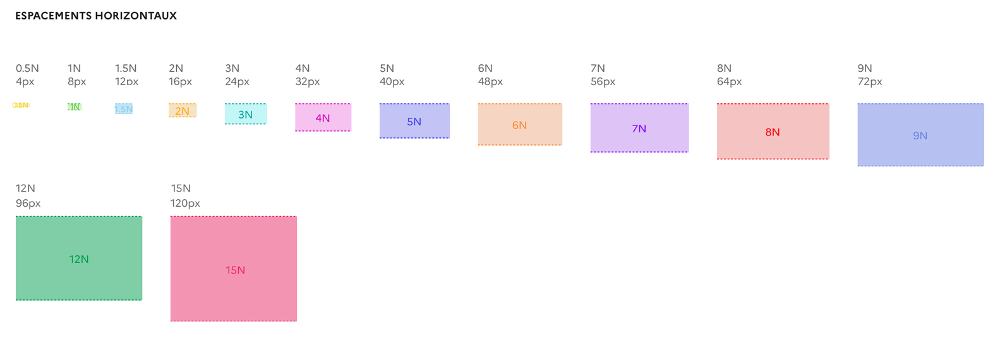

# Espacement - Spacing

<GithubLink docPath="fundamentals/Spacing.md" />

Le Design System propose un système de dimension d'espacement et de marge qui s’appuie sur les multiples de 8 (le système “8 point grid”). 

## Règle d’espacement 

Ce système d’espacement permet de garantir un homogénéité, cohérence et consistance des interfaces conçues. Cela dans le but d'améliore l’UX et de faciliter la conception et le développement.

Nous utilisons des multiples de 8px pour définir les marges et padding, auxquels s’ajoutent les espacements de 4px et 12 px afin de gérer tous les cas de figure les plus courants.

## Espacement horizontaux 

Voici le détail pour les espacements horizontaux prévus : 

## Espacement verticaux 

## Correspondance

| Nom  | Espace en px | Espace en rem |
|------|--------------|---------------|
| 0.5N |       4      |      0,25     |
|  1N  |       8      |      0,50     |
| 1.5N |      12      |      0,75     |
|  2N  |      16      |       1       |
|  3N  |      24      |      1,5      |
|  4N  |      32      |       2       |
|  5N  |      40      |      2,5      |
|  6N  |      48      |       3       |
|  7N  |      56      |      3,5      |
|  8N  |      64      |       4       |
|  9N  |      72      |      4,5      |
|  12N |      96      |       6       |
|  15N |      120     |      7,5      |

## Regles d'utilisation

### Espacement 
Chaque partie de l'interface utilisateur doit être intentionnellement conçue, y compris l'espace vide entre les éléments. Les espacements permettent de :

### Créer des relations 

Utilisez des espacements faibles entre plusieurs composants pour signaler qu’ils sont liés, ou font partie d’un même groupe (exemple : champs de formulaire) ;

Utilisez des espacements importants pour mettre en évidence un élément indépendant du reste de la page (exemple : call to action).

### Créer des hiérarchies 

Augmentez les espacements autour d’un composant clé de votre page permet d’améliorer sa visibilité. 

### Classes CSS
Des classes utilitaires sont présentes au sein du Design System afin de mettre en place ces espacements de manière simplifiée.

Il est de ce fait possible par exemple, d’ajouter un espacement en bas d’un bloc de 40 pixels par exemple (5N), en utilisant la classe .mb-10. La classes CSS sont sur une base 4px (il faut donc multiplier par 2 les valeurs)

Ces classes existent pour les propriétés de padding et de margin, pour les directions top, right, bottom et left : [https://tailwindcss.com/docs/margin#app](https://tailwindcss.com/docs/margin#app)

