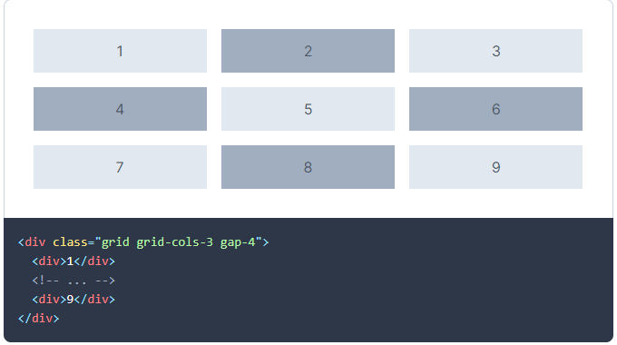

# Grille et points de rupture

<GithubLink docPath="fundamentals/Grid.md" />

La grille proposée par le Design System vous permet de structurer vos contenus. 

Elle s’articule autour de 4 points de rupture : 

| XS - Extra small | SM - Small | MD - Medium | LG - Large |
|------------------|------------|-------------|------------|
|  576px           |  768px     | 992 px      |  1200 px   |

## Tech

### Classes CSS container

| Nom        | XS - Extra small | SM - Small       | MD - Medium      | LG - Large       |
|------------|------------------|------------------|------------------|------------------|
| Classe CSS | .max-w-screen-xs | .max-w-screen-sm | .max-w-screen-md | .max-w-screen-lg |

Les classes précédentes ne se centre pas automatiquement et n'ont pas de padding par défaut. Pour les centrer et rajouter un padding, il faut utiliser les classe .mx-auto et px-N

[https://tailwindcss.com/docs/max-width#app](https://tailwindcss.com/docs/max-width#app)

Tailwind expose également une classe [.container](https://tailwindcss.com/docs/container#app)

### Grille CSS

Il est possible d'utiliser une grille CSS à la fois avec [flexbox](https://tailwindcss.com/components/flexbox-grids#app) ou [grid](https://tailwindcss.com/docs/grid-template-columns)

